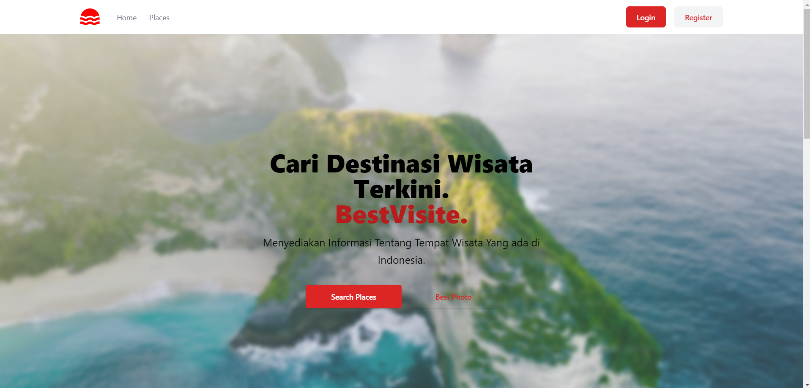
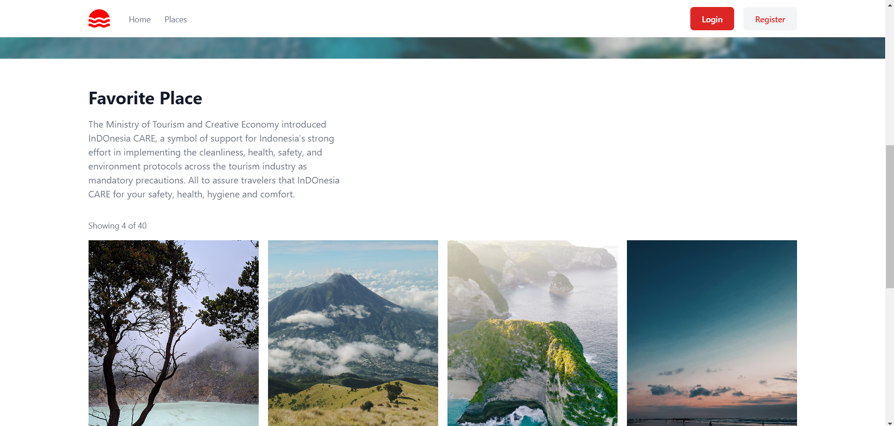
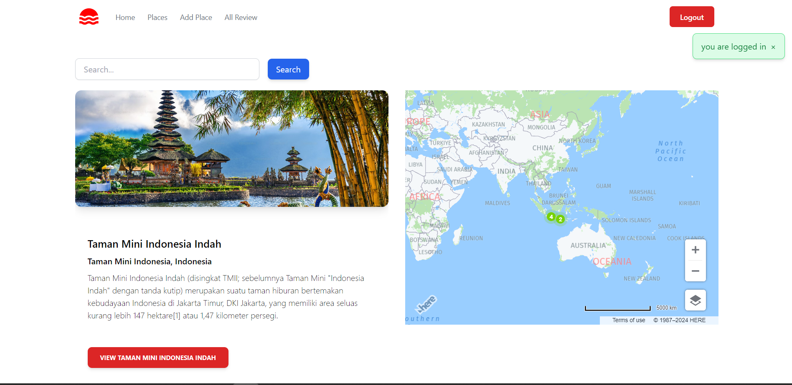
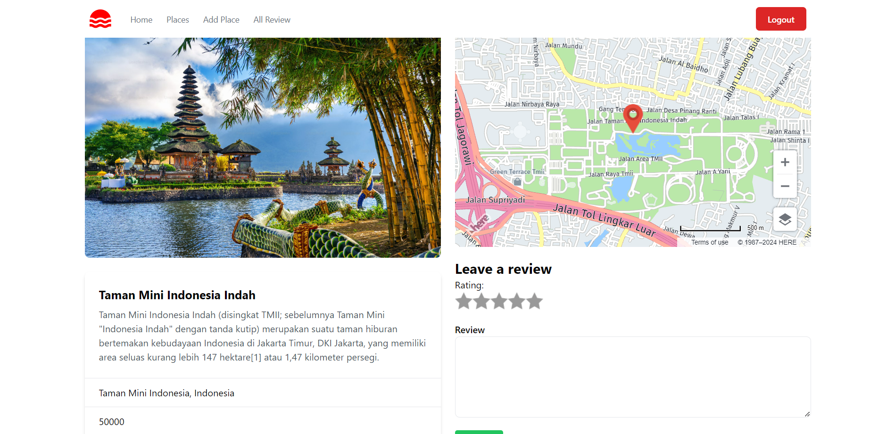
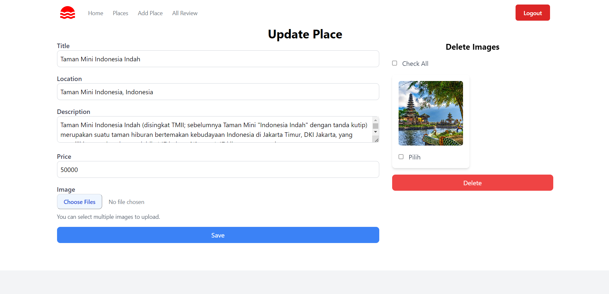

# BestVisite

Merupakan Aplikasi Website yang memberikan informasi tentang tempat wisata terbaik yang ada di Indonesia.

## Fitur

- [ ] Memberikan Informasi tempat wisata terabik di Indonesia
- [ ] Menambahkan tempat wisata
- [ ] Melakukan CRUD
- [ ] Acess Login dan Logout
- [ ] Database menggunakan MongoDB
- [ ] Maps HereMaps
- [ ] css CDN Tailwind
- [ ] Upload Gambar

## Screenshot
### Home


### Places

### Show Places

### Edit


# Bestpoint MongoDB Database

**Bestpoint** adalah database MongoDB yang digunakan untuk menyimpan informasi terkait tempat, pengguna, dan ulasan dalam sebuah aplikasi.

## Database Name
`bestpoint`

## Collections

### 1. **Places**
Collection ini menyimpan informasi tentang tempat-tempat yang tercantum di dalam aplikasi.

#### Contoh Struktur Dokumen:
```json
{
  "_id": ObjectId("60c72b2f9b1e8b5d2f8f7e1a"),
  "name": "Central Park",
  "location": {
    "type": "Point",
    "coordinates": [-73.965355, 40.782865]
  },
  "description": "A large public park in New York City.",
  "category": "Park",
  "rating": 4.8,
  "created_at": ISODate("2023-09-08T14:48:00Z")
}


## Instalasi

Instruksi untuk menginstal dan menjalankan proyek ini secara lokal.

```bash
git clone https://github.com/username/repository-name.git
cd repository-name
npm install
npm start

